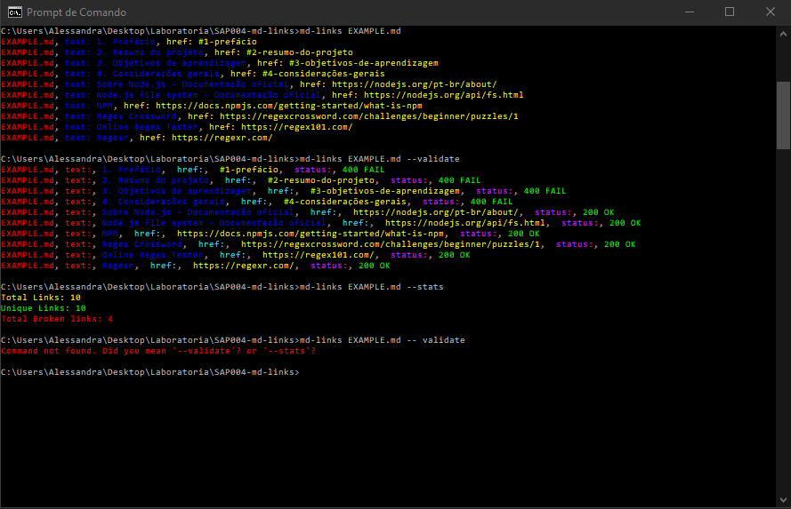

# .MD links

## Índice

* [1. Introdução](#1-introdução)
* [2. Instruções de Instalação e Uso](#2-intruções-de-instalação-e-uso)
* [3. Ferramentas e Bibliotecas](#3-ferramentas-e-bibliotecas)

***

## 1. Introdução

O presente projeto teve como objetivo criar uma  biblioteca utilizando **Node.js**, que identifique links em arquivos de extensão *.md*.

Estes arquivos normalmente contém *links* que muitas vezes estão quebrados, ou que já não são válidos e isso prejudica muito o valor da informação.

Portanto, o objetivo além de acessar os links destes arquivos, também é o de validá-los retornando seu *status code*.

## 2. Instruções de Instalação e Uso

É necessário que já tenhas instalado as últimas versões do **Node.js** e **npm**.

Em algum terminal, digitar o comando abaixo para instalá-la globalmente, podendo assim ser usada em qualquer um de seus projetos.

No terminal, digite `npm install -g alessandramarinho/SAP004-md-links`

Este comando por si só já irá fazer a biblioteca funcionar, contudo cabe ao usuário saber se o diretório informado por ele possui algum arquivo markdown, caso contrário a lib não terá como funcionar.

Após a instalação, você pode utilizar a biblioteca da seginte maneira (lembrando que esta biblioteca lê apenas arquivos com a extensão **.md**):

Para ter acesso apenas aos links, digite no terminal `md-links caminho-do-arquivo/arquivo.md`, isto retornará uma array com objetos contento `text`, para o título do link, e `href`, para o link propriamente dito.

Para ter acesso aos links com a validação usando *HTTP status code* digite `md-links caminho-do-arquivo/arquivo.md --validate`, o que retorna, além de `text` e `href`, a propriedade `status` com o status da url.

Caso se deseje saber estatísticas sobre os links, como por exemplo quantos deles são únicos e o total geral do arquivo, basta digitar:
 `md-links caminho-do-arquivo/arquivo.md --stats`

Caso após a utilização, se deseje retirar a biblioteca da máquina, basta digitar:

`npm uninstall -g md-links`

## 3. Ferramentas e Bibliotecas

Para o desenvolvimento desse projeto foram utilizados os seguintes programas, bibliotecas e suas respectivas versões: 

* Chalk- Versão 4.1.0

* Node.js- Versão 12.16.1

* Valid-url- Versão 1.0.9

* Node-fetch- Versão 2.6.0

* NPM- Versão 6.14.5

